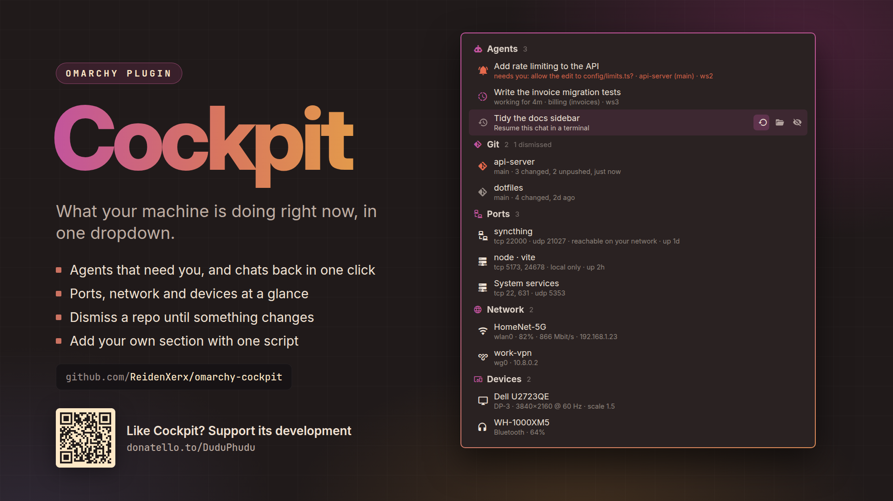

# Cockpit



An [Omarchy](https://omarchy.org) bar widget: one hub for **what the machine is doing right
now**, so you stop switching workspaces to find out.

Which AI sessions are working, which are waiting for you, and on what — and the chat you
closed an hour ago, back in a terminal with one click. File transfers with real progress.
Long-running jobs you started and forgot. Repos with work that exists on exactly one disk.
Which ports are taken and by what, how you are connected, and what is plugged in. Whether a
reboot is owed. Extensible with your own providers.


## Install

```bash
omarchy plugin add https://github.com/ReidenXerx/omarchy-cockpit.git --enable
```

Optionally add its entries to the Omarchy menu:

```bash
~/.config/omarchy/plugins/reidenxerx.cockpit/bin/cockpit-menu-install
```

## What ships

| section | what it tells you |
|---|---|
| **Reboot** | kernel or driver updated since boot, in one row rather than one per package |
| **Agents** | terminal AI sessions: **needs you** (a question or a prompt), **working** or **idle**, with the task, the project and its branch — click to jump there. Chats that ended in the last day stay listed: click one to resume it |
| **Transfers** | `cp` `mv` `rsync` `curl` `wget` `tar` `dd` with real %, rate and ETA |
| **Jobs** | long-running commands you started in a shell, with elapsed time |
| **Git** | unpushed commits always; dirty trees only if touched recently. Dismiss a repo you know about: it stays hidden until something in it changes |
| **Ports** | what is listening, on which ports, and whether only this machine or your whole network can reach it — open a local web server in the browser, or stop the process |
| **Updates** | pacman / AUR / flatpak pending |
| **GPU** | discrete GPU power state and what is holding it awake |
| **Tailnet** | which of your machines are up, direct or relayed |
| **Network** | the links you are on — Wi-Fi with its signal, Ethernet with its speed, VPNs — and a warning when there is no internet or a network wants you to sign in |
| **Devices** | external displays, connected Bluetooth devices with their battery, and USB devices you plugged in |
| **Disks** | filesystems past 85%, and volumes you mount on demand |

Sections cap at six rows with a `+N more` you can click. Only things genuinely **in
motion** light the dot on the bar icon — pending updates, dirty repos and open ports are true
all day, and a badge that never goes out is one you stop reading. The dot turns **urgent**
while an agent is waiting on you, and the tooltip leads with how many are.

Point at a row and its buttons appear: open a project's folder, resume a chat, open a local
server, stop a process. A button that cannot be undone, like stopping a process, asks first:
the first click shows the question, the second acts. **Dismiss** hides a row until what it
shows changes — a repo comes back with its next commit or edit — and the section heading
counts what is hidden, with a click to bring it all back.

## Agents

**Claude Code sessions report their own status.** Each running session keeps a small
record in `~/.claude/sessions/<pid>.json`: `busy` for the whole of a turn — tool calls
included — `waiting` when something needs you, with the reason, and `idle` once it is done.
Cockpit reads those records (read-only) and shows:

| icon | status | row |
|---|---|---|
| bell | waiting on a question | **needs you: question** |
| bell | waiting on a permission or other dialog | **needs you: prompt open**, or the choice itself when the session names it |
| bell | sandbox or worker request | **needs you: sandbox request** / **worker request** |
| clock | turn in progress | **working for 3m** |
| console | turn over, a background command it started still running | **working in background for 3m** |
| check | done | **idle for 12m** |
| cog | a status newer than this version knows | shown as written, e.g. **compacting context for 1m** |
| history | the session ended | **ended 20m ago** — click to resume the chat |

Next to the status: the project folder, its git branch, and the workspace, so three sessions
in three repos are told apart at a glance. The title is the task Claude Code puts in its
terminal title.

Each session is tied to its window by walking up from its process to the one that owns a
Hyprland window, so a click jumps to the right terminal. When one terminal process owns
several windows (a foot server, Ghostty, single-instance kitty), the window titled the way
Claude Code titles its terminal is chosen, and only if exactly one is. A session with no
window it can be tied to (tmux, a background job) still shows, without the jump. A record
counts only while its pid still names the process that wrote it — the process start time
has to match — so a leftover file from a crashed session never shows as a live one.

**A chat you closed is one click away.** `cockpit-agentd` remembers the last 50 sessions — the
session id, its folder, its task — in `~/.local/state/omarchy-cockpit/agent-history.json`,
written when a session starts or ends, and at most every five minutes while only its task
changes. For a day after a chat ends, its row stays in
the section: clicking it opens your terminal in that folder running `claude --resume` with
that session. Cockpit checks first that the folder and the conversation are still there.
Dismiss the row if you are done with it.

**Notifications.** While the hub is closed you still hear about the two moments that matter:
a session starting to wait for you, and a session finishing a turn that took more than a
minute. Neither is sent when that session's window is the one you are in. **Show** takes you
to it. Turn them off with *Notify me about agents* in the widget's settings.

**Other terminal agents are read from their window title.** Codex, opencode, crush and the
rest show a spinner glyph in the title while they stream output. `hyprctl clients` serves a
*cached* title — sampled ten times in two seconds it returns the identical glyph while the
compositor's own event socket reports the spinner turning — so `cockpit-agentd` holds
`.socket2.sock` open and records when each title actually last changed. The panel starts
it, so it dies with the shell. Busy-detection compares titles rather than matching a list
of known spinner glyphs, which keeps it working when a tool changes its alphabet.

A title spinner goes quiet during a long tool call and cannot show a question, so these
rows say **working** or **last active 4m**, never "idle" or "needs you": the label does not
claim more than the title can tell.

## Write your own provider

Drop an executable in `~/.config/omarchy/cockpit/providers/`. It prints one JSON object and
appears in the hub. A file there shadows a built-in of the same name, so anything shipped
can be replaced without editing the plugin.

```json
{
  "section": "Work",
  "glyph": "󰜎",
  "priority": 35,
  "intervalSec": 60,
  "timeoutSec": 20,
  "rows": [
    { "glyph": "󰊢", "title": "api-server", "detail": "3 files changed",
      "state": "warn", "progress": 40,
      "action": { "kind": "terminal", "argv": ["git", "-C", "/home/you/src/api-server", "status"] },
      "buttons": [
        { "glyph": "󰝰", "label": "Open the folder",
          "action": { "kind": "open-folder", "path": "/home/you/src/api-server" } }
      ],
      "dismiss": { "key": "/home/you/src/api-server", "marker": "3 files, newest 14:02" } }
  ]
}
```

`state` is `ok` · `busy` · `warn` · `needs` · `idle`. It tints the row; `busy` lights the
bar dot, and `needs` — something stalled until you act — tints the detail line and turns
the dot urgent. Keep `warn` for things that are true all day. `progress` draws a bar when
present. `intervalSec` and `timeoutSec` are the provider's own budget — scanning repos or
asking a mirror what is stale legitimately costs more than reading `/proc`, and the runner
caches each provider separately so an expensive one is not re-run because a cheap one
ticked.

`buttons` are up to three, each with a `glyph`, a `label` (shown while you point at it), an
`action` and, optionally, a `confirm` question asked before acting. `dismiss` makes a row
dismissible: `key` names the row, and `marker` sums up what it shows — while the marker stays
the one that was dismissed, the row stays hidden; when it changes, the row is back.

**Actions are structured** (changed in 1.1 — before that `action` was a shell command
line, and such strings are now ignored with a note in the hub). A click can do one of:

| action | does |
|---|---|
| `{"kind": "focus-window", "address": "0x55d0c0ffee"}` | focuses that Hyprland window |
| `{"kind": "terminal", "argv": [...]}` | runs the command in Omarchy's floating presentation terminal |
| `{"kind": "run", "argv": [...]}` | runs the command in the background, with a deadline |
| `{"kind": "open-url", "url": "http://127.0.0.1:5173/"}` | opens a local address in your browser — `127.0.0.1`, `localhost` or `[::1]` with a port, nothing else |
| `{"kind": "open-folder", "path": "/home/you/src/api"}` | opens a folder inside your home in your file manager |
| `{"kind": "stop-process", "pid": 4121, "start": "8812734"}` | sends SIGTERM to a process of yours, if it is still the one that started at that time |
| `{"kind": "resume-agent", "session": "<id>", "cwd": "/home/you/src/api"}` | opens your terminal in that folder running `claude --resume <id>` |

`argv` is never given to a shell, and only these commands are accepted:

| program | arguments |
|---|---|
| `git` | `-C <absolute path inside your home> status [--short, --branch, --porcelain, …]` |
| `checkupdates` | none |
| `yay`, `paru` | `-Qua` or `-Syu` |
| `flatpak` | `update` or `remote-ls --updates` |
| `tailscale` | `up` or `status` |
| `ping` | `-c1 <host>` or `-c <1-9> <host>` |
| `udisksctl` | `mount` or `unmount`, `-b /dev/<device>` |

Anything else is dropped from the row (the rest of the row still shows). Dismissing is the
runner's own: a provider asks for it with `dismiss`, and an action of that kind from a
provider is dropped.

The runner's limits: 256 KB of output, 200 rows per section, 1 KB per string, 30 seconds.
Anything else on stdout, a non-zero exit, a timeout or an overrun means that provider is
skipped with a visible note, keeping its last good output. One broken provider never takes
the hub down.

```bash
bin/cockpit --list          # providers found, where from, and why one was skipped
bin/cockpit --plain         # human-readable, for checking a provider's output
bin/cockpit --only agents   # run one, uncached
```

## Security

- **No shell.** Helpers run as `/usr/bin/python3 <plugin>/bin/…`; every external program is
  resolved to a root-owned binary in `/usr/bin` and run with `PATH=/usr/bin`, a deadline,
  an output ceiling and a whole-process-group kill (`bin/plugin_safety.py`, shared with
  the author's other plugins). The panel stops any helper that overruns.
- **Clicks carry data, not commands.** A row action travels to `cockpit action` over stdin
  (8 KB cap) and is checked against the allow-list above before anything runs. Window
  addresses must be hex; hosts, devices and repo paths can only fill their own slot. What
  the panel starts itself — a terminal, `xdg-open`, a resumed chat — must match one of three
  exact command shapes, checked again in the panel.
- **Stopping a process is narrow.** Only a process you own, only while its start time still
  matches the row (a pid reused by another process is refused), pinned with a pidfd before
  that check so it cannot change hands in between, never Cockpit's own shell or anything
  above it, and only after the second click.
- **Opening is local.** `open-url` takes loopback addresses with a port and nothing else;
  `open-folder` takes an existing folder inside your home, not a symlink.
- **Resuming checks what it resumes.** The session id must be a UUID, the folder must exist
  inside your home, the conversation must still be in `~/.claude/projects`, and `claude` is
  run from `~/.local/bin` only if it is a file you own that nobody else can write (else
  `/usr/bin/claude`). Cockpit never writes to `~/.claude`.
- **Your providers must be yours.** A user provider is run only if it is a regular file you
  own, not group- or other-writable, reached without symlinks; otherwise the hub says why
  it was skipped.
- **Repositories are untrusted.** Git runs with hooks and the filesystem monitor off, every
  filter driver a repository defines blanked (a hostile `.git/config` can otherwise make
  `git status` run a program), no system config and no optional locks. Git roots must
  resolve inside your home, and the scan below a root never follows a symlink.
- **Bounded input everywhere.** Provider output, the Hyprland event stream (8 KB per event,
  64 KB buffered, 256-character titles, 256 windows), `hyprctl`/`tailscale`/`lsblk`/`ss`/
  `nmcli`/`busctl` output, Claude Code session records (64 files, 16 KB and four levels deep
  each, regular files you own reached without symlinks, display text stripped of control
  characters) and every state file are size- and structure-capped. Files are read and
  written without following symlinks, through random temporary files and atomic renames.

## Configuration

| file | effect |
|---|---|
| `~/.config/omarchy/cockpit/providers/` | your providers |
| `~/.config/omarchy/cockpit/git-roots` | directories to scan for repos, one per line (first 64 lines; absolute or `~/` paths inside your home) |
| `~/.config/omarchy/cockpit/dirty-within-days` | how recent a dirty tree must be to show (default 7) |

Rows per section, the refresh interval and the agent notifications are in the widget's own
settings.

## Development

```bash
python3 tests/cockpit_test.py        # runner, actions, daemon, agent sessions, providers, hostile git repos
python3 tests/agents_test.py         # agent rows, branches, chat history, notifications
python3 tests/hub_test.py            # buttons, dismissing, opening, stopping, resuming
python3 tests/connectivity_test.py   # ports, network, devices
node tests/model_test.js             # panel display logic
```

## Remove

```bash
bin/cockpit-menu-install remove
omarchy plugin remove reidenxerx.cockpit
```

Session state lives in `$XDG_RUNTIME_DIR/omarchy-cockpit/` and is gone at logout. What has
to outlive it — the rows you dismissed and the recent agent sessions — is in
`~/.local/state/omarchy-cockpit/`; delete that folder to forget them. Version 1.0 kept state
in `~/.cache/omarchy-cockpit/`, which is no longer used and can be deleted. The daemon stops
with the shell; nothing else is left running. Cockpit never writes to `~/.claude`.

## Support

If Cockpit is useful to you, you can support its development on [Donatello](https://donatello.to/DuduPhudu).

## License

MIT
